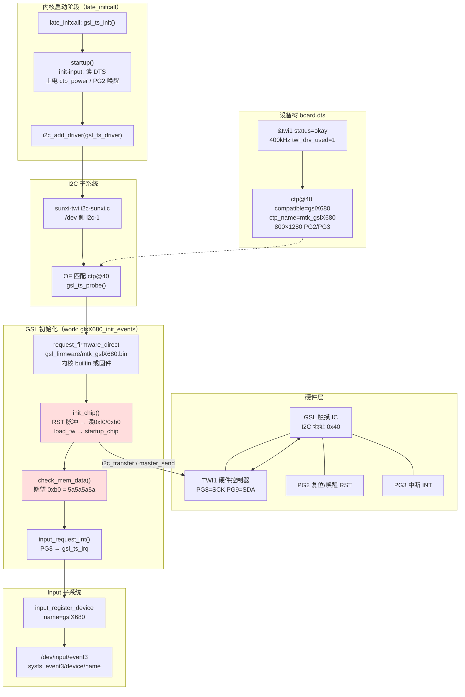
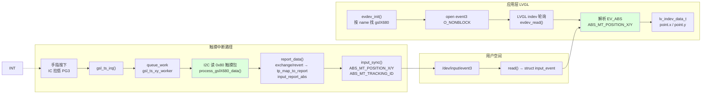
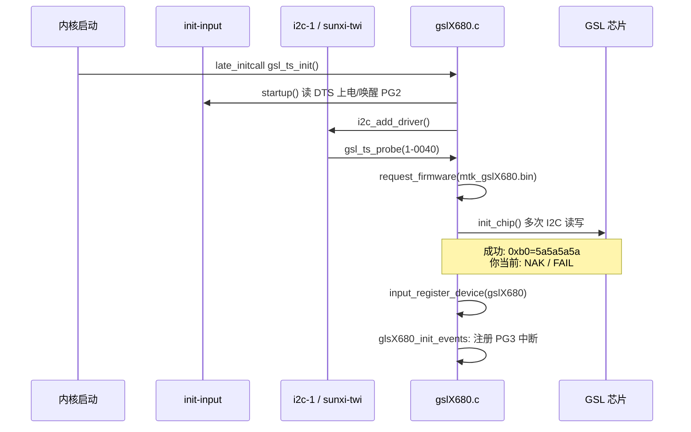

下面按 **H133-02 / TP-H10 / GSL（`mtk_gslX680`）** 本工程实际代码，画出从触摸芯片到应用坐标的完整链路。你当前故障点在图中 **「I2C 无 ACK」** 处，链路后半段不会真正跑起来。

---

## 总览流程图（启动 + 触摸上报）



**说明（你当前状态）**：`init_chip` / `check_mem_data` 在 **I2C 无 ACK** 时失败（`5a5a5a5a(FAIL)`），芯片未进入可采样状态；后面 IRQ 虽可能注册，但 **`touch_cnt=0`，无坐标**。

---

## 运行时：手指按下 → 应用坐标



---

## 分层对照表

| 阶段 | 组件 | 关键文件/节点 |
|------|------|----------------|
| 硬件 | GSL @ 0x40，TWI1，PG2/PG3 | 原理图 TP-H10 |
| DT | `twi1` + `ctp@40` | `device/.../p1_nor/linux-5.4/board.dts` |
| 公共配置 | GPIO/IRQ/分辨率/上电 | `init-input.c` |
| I2C 总线 | `sunxi-twi` → `i2c-1` | `i2c-sunxi.c` |
| 触摸驱动 | probe / init / 上报 | `gslx680new/gslX680.c` |
| 坐标映射 | `ctp_screen_max` → `ctp_report_max` | 见 [GSL触摸坐标映射](../开发记录/GSL触摸坐标映射/README.md) |
| 固件 | `mtk_gslX680.bin` | `bsp_defconfig` EXTRA_FIRMWARE + builtin |
| 字符设备 | `event3` | `input` 核心 |
| GUI | evdev 指针 | `lv_drivers/indev/evdev.c` |
| 其它应用 | 可配 `touch_dev` | `docs/LV_DS-双屏异显中间件架构.md` |

---

## 启动时序（简化）



---

## 坐标数据形态（各层）

```text
触摸 IC 寄存器 0x80 触摸帧
    → process_gslX680_data() 解析 id,x,y,pressure
    → report_data() 按 DTS 做 revert_x/y、exchange_x_y，限制 800×1280
    → input_report_abs(ABS_MT_POSITION_X/Y, …)
    → 内核 input 缓冲区
    → read(/dev/input/event3) 得到 input_event { type=EV_ABS, code=ABS_MT_*, value }
    → evdev_read() 写入 evdev_root_x / evdev_root_y
    → LVGL lv_indev_data_t → 控件命中、绘图
```

---

## 与你问题的对应关系

| 链路环节 | 典型状态（2026-05 新内核日志） |
|----------|-------------------------------|
| DTS / 驱动 probe | ✅ `mtk_gslX680`、`1-0040`、`event3` |
| `init_chip` I2C | ✅ 最终 `startup` 后 `b0=5a5a5a5a(OK)` |
| IRQ → worker → 读 0x80 | ⚠️ 若 `irq_cnt` 一直为 0，查 PG3；驱动已加 **25ms 轮询兜底** |
| LVGL | ⚠️ 需 **POINTER** `indev` + 坐标校准 800×1280→fb |

## 板上快速自检

```bash
# 不要用 -lt（BusyBox 无 inotify）
getevent /dev/input/event3

# 摸屏后看计数
cat /sys/class/ctp/tp_irq_state
dmesg | grep -E 'gslX680-touch|touch poll'

# 期望：touch_cnt / worker_cnt 增加；出现 gslX680-touch: fingers=...
```

## 软件侧已做修改（H133-02）

1. **内核** `gslX680.c`：`GSL_TOUCH_POLL_MS=25` 轮询读 0x80；有触摸时 `gslX680-touch` 日志。
2. **lv_projector** `main.c`：注册 `LV_INDEV_TYPE_POINTER` + `evdev_read`。
3. **lv_drv_conf.h**：`EVDEV_CALIBRATE`，`HOR_MAX=800`，`VER_MAX=1280`。

需 **重编 kernel + lv_projector/rootfs** 后整包烧录验证。