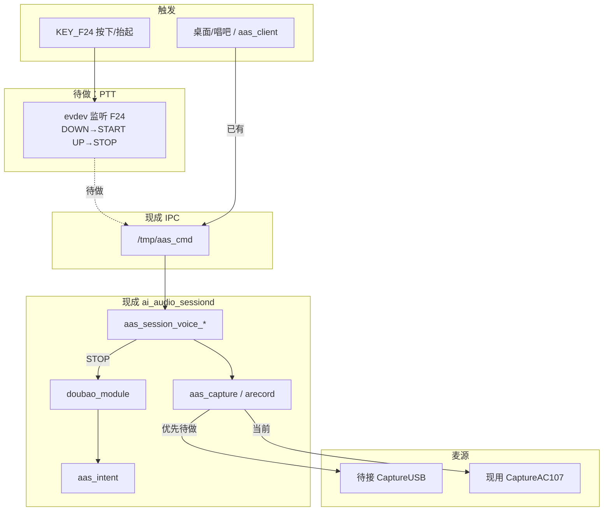

# 2.4G 空鼠麦接入 ai_audio_session 方案

- 日期：2026-09-16（文档整理 2026-09-20）
- 板级：`p1_emmc_JL_M101`
- 设备：`Tmall.c0m 2.4G Wireless Air Mouse`（`7045:2018`）
- 状态：**方案备忘，尚未改业务代码接入**

驱动与试录前提见同目录 [`开发记录.md`](./开发记录.md)。

---

## 1. 目标

长按 2.4G 遥控器语音键（`KEY_F24`）→ H133 采到 USB 麦 PCM → 走现有语音会话 → ASR/对话 → 转成点歌等命令。

**原则：**

- 复用现成 `ai_audio_session`（`ai_audio_sessiond`），不另起 ASR 管线
- **不要**把 F24 接到桌面 LVGL 长按逻辑
- 尽量按声卡**名**选设备，不写死 `hw:3,0`

---

## 2. 现成链路（已有）

```text
UI / aas_client
    → 写 /tmp/aas_cmd
        VOICE START app=... seq=...
        VOICE STOP  app=... seq=...
    → ai_audio_sessiond
        aas_session_voice_start/stop
        aas_capture → arecord
        doubao_module（ASR + LLM）
        aas_intent（点歌/退出等）
    → /tmp/aas.evt、桌面/子应用命令
```

| 模块 | 路径 | 作用 |
|---|---|---|
| 守护进程 | `lib/ai_audio_session/daemon/` | `ai_audio_sessiond` |
| FIFO 命令 | `/tmp/aas_cmd` | `VOICE` / `CAPTURE` / `TEXT` … |
| 客户端 | `aas_client.c` | `aas_voice_start/stop()` |
| 采集 | `aas_capture.c` | fork `arecord` |
| 识别对话 | `doubao_module.c` | 处理 wav / 文本 |
| 意图 | `aas_intent.*` | 事件 → 业务命令 |

当前采集设备写死为 **`CaptureAC107`**（`asound.conf` → `hw:sndi2s1`），并可能经 MCU（`/dev/ttyS3`）开录音通道。  
**这是板载 I2S 麦路径，不是 USB 空鼠麦。**

代码根目录：

`platform/thirdparty/gui/lvgl-8/lib/ai_audio_session/`

---

## 3. 缺口（待接）

| 缺口 | 说明 |
|---|---|
| 麦源 | USB 声卡（常见名 `Mouse` / `USB-Audio`）未进 `aas_capture` |
| 触发 | 无 F24 DOWN/UP → `VOICE START/STOP` |
| 隔离 | 需保证 F24 不进桌面快捷键/长按 |

驱动与 Host 已具备；产品接入 = **换麦 + 接键**。

---

## 4. 目标流程

```text
KEY_F24 DOWN
    → PTT 胶水（独立进程/daemon 线程，不进 desk）
    → /tmp/aas_cmd : VOICE START app=tmall seq=N
    → aas_capture : arecord -D CaptureUSB（优先）
    → /tmp/aas_voice.wav

KEY_F24 UP
    → VOICE STOP
    → doubao_module_process_audio_file(wav)
    → aas_intent → 命令
    → /tmp/aas.evt（asr_text / llm_reply 等）
```

回退：无 USB 声卡时仍可用 `CaptureAC107`（兼容旧麦）。

---

## 5. 流程图



---

## 6. 建议改动点（后续实施）

### 6.1 ALSA（`asound.conf`）

板级：`openwrt/target/h133/h133-<板件>/busybox-init-base-files/etc/asound.conf`

增加按**卡名**的逻辑 PCM，例如：

```text
pcm.CaptureUSB {
    type plug
    slave.pcm "hw:Mouse,0"
    slave.rate 16000
    slave.format S16_LE
    slave.channels 1
}
```

勿写死 card 号。若卡名变更，探测逻辑需匹配 `Mouse` / `USB-Audio` / VID `7045`。

### 6.2 `aas_capture.c`

- `acquire`/`start`：有 USB 则用 `CaptureUSB`（16k/mono）；否则 `CaptureAC107`
- **USB 路径不要调用** `aas_mcu_open_record_channel()`（MCU 路由仅服务 AC107）
- 保持现有 owner / `CAPTURE_BUSY` 互斥

### 6.3 F24 PTT（独立）

- 扫 `/dev/input` 找 Keyboard / `KEY_F24`(194)
- DOWN → `aas_voice_start("tmall")` 或写 FIFO
- UP → `aas_voice_stop("tmall")`
- 异常/超时 → `VOICE CANCEL`
- **不**注册到 desk LVGL 按键

可先手工验证：

```sh
echo 'VOICE START app=tmall seq=1' > /tmp/aas_cmd
# 说话若干秒
echo 'VOICE STOP app=tmall seq=1' > /tmp/aas_cmd
```

### 6.4 识别与意图

优先不改 `doubao_module` / `aas_intent`。  
STOP 后确认 `/tmp/aas_voice.wav` 有声，再看 `/tmp/aas.evt`。

---

## 7. 推荐实施阶段

| 阶段 | 内容 | 验收 |
|---|---|---|
| A | `CaptureUSB` + capture 优先 USB | 手动 VOICE START/STOP，wav 为人声 |
| B | F24 → VOICE，不进桌面 | 长按说话能出 asr_text |
| C | 掉线/卡名/互斥稳态 | `-62` 后可恢复；与 AC107 不双开 |
| D | 开机拉起 daemon + PTT | 产品路径可用 |

---

## 8. 明确不做

1. 不把 F24 接到桌面长按再录音  
2. 不另写一套 ASR HTTP  
3. USB 录音时不开 MCU 录音通道  
4. 不写死 `hw:3,0`

---

## 9. 风险备忘

- USB 空闲/`-62` 掉线：PTT 需 CANCEL/提示；录音前可 `power/control=on`
- OHCI 全速 + UAC 有 `retire_capture_urb`：先保证短句（约 2～8s）
- `usbc0` 已改 Host；勿再 `cat .../usb_device`
- 遥控器若更换，以新设备卡名/按键为准

---

## 10. 关键路径速查

| 项 | 位置 |
|---|---|
| USB Audio 开发记录 | [`开发记录.md`](./开发记录.md) |
| 会话库 | `platform/thirdparty/gui/lvgl-8/lib/ai_audio_session/` |
| 采集 | `.../src/aas_capture.c` |
| FIFO | `.../src/aas_cli_fifo.c`，路径 `/tmp/aas_cmd` |
| 客户端 | `.../client/aas_client.h` |
| JL asound | `openwrt/target/h133/h133-<板件>/.../etc/asound.conf` |
| 内核/USB 补丁 | [`patches/`](./patches/) |
