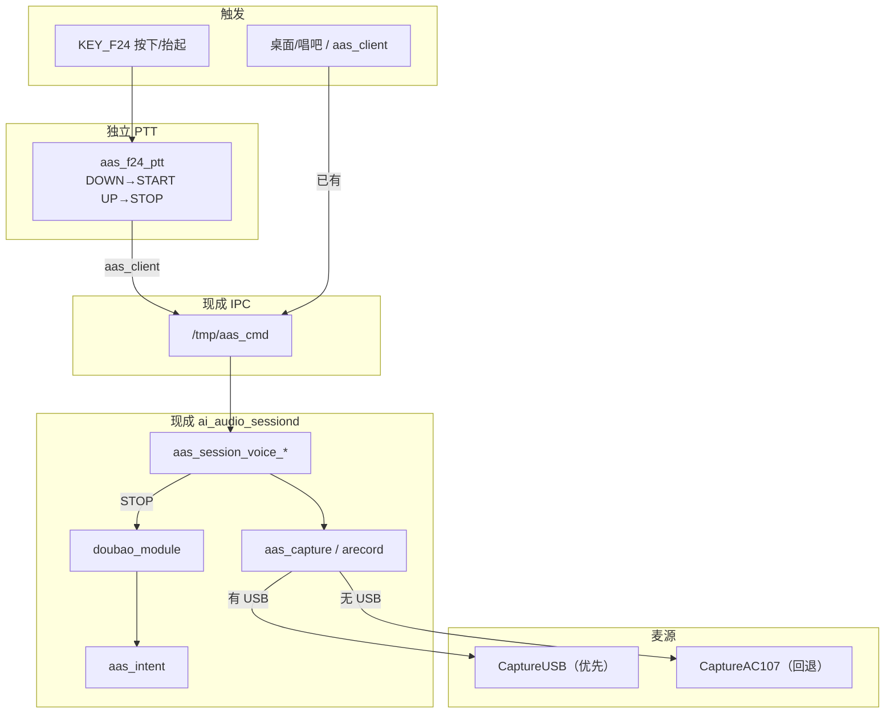

# 2.4G 空鼠麦接入 ai_audio_session 方案

- 日期：2026-09-16（文档整理 2026-09-20）
- 板级：`p1_nor_JL_M101`（NOR；`CaptureUSB` 仅此板 asound）
- 设备：`Tmall.c0m 2.4G Wireless Air Mouse`（`7045:2018`）
- 状态：**独立按键进程方案已验证采音**；开机自启未过（见 §7 / 开发记录 §7.5），后续再定

驱动与试录前提见同目录 [`开发记录.md`](./开发记录.md)。

### 已落地改动

| 项 | 位置 | 补丁 |
|---|---|---|
| `pcm.CaptureUSB` | **仅** `h133-p1_nor_JL_M101/.../etc/asound.conf` | `patches/0006-*.patch` |
| capture 优先 USB、跳过 MCU | `lib/ai_audio_session/src/aas_capture.c` | `patches/0003-*.patch` |
| F24 → VOICE | `ptt/aas_f24_ptt.c`（独立进程） | `patches/0004-*.patch` |
| 包装编 PTT + `libaas_client.so.1` | `openwrt/package/.../ai_audio_session/` | `patches/0005-*.patch` |

**追溯**：源码以仓库路径为准；若 Review 未列出某文件，用补丁对照。重放见 `patches/README.md` / `patches/apply.sh`。

NOR 镜像（2026-09-28）：`artifacts/h133_linux_p1_nor_JL_M101_uart0_nor.img`  
MD5：`854f24e03ccd1ba911259d2fb8905cab`  
有效录音样例：`artifacts/aas_voice_f24.wav`

板端验收（若开机未起，先手动 start）：

```sh
ps | grep -E 'ai_audio_sessiond|aas_f24_ptt' | grep -v grep
# 若无进程：
/etc/init.d/ai_audio_sessiond start
/etc/init.d/aas_f24_ptt start
# 或：
/usr/bin/ai_audio_sessiond >/tmp/aas_daemon.log 2>&1 &
/usr/bin/aas_f24_ptt >/tmp/aas_ptt.log 2>&1 &
ls -l /tmp/aas_cmd          # 必须是 prw
# 长按 F24；勿用 echo> 测 FIFO
ls -l /tmp/aas_voice.wav
```

---

## 1. 目标

长按 2.4G 遥控器语音键（`KEY_F24`）→ H133 采到 USB 麦 PCM → 走现有语音会话 → ASR/对话 → 转成点歌等命令。

**原则：**

- 复用现成 `ai_audio_session`（`ai_audio_sessiond`），不另起 ASR 管线
- **不要**把 F24 接到桌面 LVGL 长按逻辑
- 尽量按声卡**名**选设备，不写死 `hw:3,0`

---

## 2. 现成链路（已有）

```text
UI / aas_client
    → 写 /tmp/aas_cmd
        VOICE START app=... seq=...
        VOICE STOP  app=... seq=...
    → ai_audio_sessiond
        aas_session_voice_start/stop
        aas_capture → arecord
        doubao_module（ASR + LLM）
        aas_intent（点歌/退出等）
    → /tmp/aas.evt、桌面/子应用命令
```

| 模块 | 路径 | 作用 |
|---|---|---|
| 守护进程 | `lib/ai_audio_session/daemon/` | `ai_audio_sessiond` |
| FIFO 命令 | `/tmp/aas_cmd` | `VOICE` / `CAPTURE` / `TEXT` … |
| 客户端 | `aas_client.c` | `aas_voice_start/stop()` |
| 采集 | `aas_capture.c` | fork `arecord` |
| 识别对话 | `doubao_module.c` | 处理 wav / 文本 |
| 意图 | `aas_intent.*` | 事件 → 业务命令 |

当前采集：无 USB 时仍为 **`CaptureAC107`**（`hw:sndi2s1`，可能经 MCU）；有 USB 空鼠麦时优先 **`CaptureUSB`**（`hw:Mouse`，不开 MCU）。

代码根目录：

`platform/thirdparty/gui/lvgl-8/lib/ai_audio_session/`

---

## 3. 已补齐（相对旧板载麦方案）

| 项 | 现状 |
|---|---|
| 麦源 | `aas_capture` 优先 `CaptureUSB`（补丁 0003 + asound 0006） |
| 触发 | 独立进程 `aas_f24_ptt`：F24 → `aas_voice_start/stop`（补丁 0004/0005） |
| 隔离 | **不**进 desk / LVGL；**不**塞进 `ai_audio_sessiond` 内部线程 |

---

## 4. 目标流程（已落地）

```text
KEY_F24 DOWN
    → 独立进程 aas_f24_ptt
    → aas_voice_start("tmall") → /tmp/aas_cmd
    → aas_capture : arecord -D CaptureUSB（优先）
    → /tmp/aas_voice.wav

KEY_F24 UP
    → aas_voice_stop("tmall")
    → doubao_module_process_audio_file(wav)
    → aas_intent → 命令
    → /tmp/aas.evt（asr_text / llm_reply 等）
```

回退：无 USB 声卡时仍可用 `CaptureAC107`。

---

## 5. 流程图


```mermaid
flowchart TB
  subgraph trigger["触发"]
    F24["KEY_F24 按下/抬起"]
    UI["桌面/唱吧 / aas_client"]
  end

  subgraph glue["独立 PTT"]
    PTT["aas_f24_ptt<br/>DOWN→START UP→STOP"]
  end

  subgraph ipc["现成 IPC"]
    FIFO["/tmp/aas_cmd"]
  end

  subgraph daemon["现成 ai_audio_sessiond"]
    SES["aas_session_voice_*"]
    CAP["aas_capture / arecord"]
    DB["doubao_module"]
    INT["aas_intent"]
  end

  subgraph mic["麦源"]
    USB["CaptureUSB（优先）"]
    AC107["CaptureAC107（回退）"]
  end

  F24 --> PTT
  PTT -->|aas_client| FIFO
  UI -->|已有| FIFO
  FIFO --> SES --> CAP
  CAP -->|有 USB| USB
  CAP -->|无 USB| AC107
  SES -->|STOP| DB --> INT
```

---

## 6. 实现要点（与补丁一致）

### 6.1 ALSA

**仅** `h133-p1_nor_JL_M101/.../etc/asound.conf` 增加 `pcm.CaptureUSB` → `hw:Mouse,0`（16k/mono）。勿写死 card 号。

### 6.2 `aas_capture.c`

有 USB 用 `CaptureUSB`；否则 `CaptureAC107`。USB 路径**不**开 MCU 录音通道。

### 6.3 F24 PTT（独立进程，定案）

- 二进制：`/usr/bin/aas_f24_ptt`（源码 `ptt/aas_f24_ptt.c`）
- DOWN/UP → `aas_voice_start/stop("tmall")`
- 开机：`S84aas_f24_ptt`（晚于 `S83ai_audio_sessiond`）
- **不做**：desk 键盘钩子、daemon 内嵌线程

验收勿用 `echo > /tmp/aas_cmd`（会弄坏 FIFO）；用长按 F24 或 `aas_client`。

### 6.4 识别与意图

不改 `doubao_module` / `aas_intent`。无 ASR 密钥时可能 `missing credentials`，与采音无关。

---

## 7. 验收阶段

| 阶段 | 内容 | 状态 |
|---|---|---|
| A | CaptureUSB + capture 优先 USB | 已验（0003/0006） |
| B | 独立 F24 → VOICE + 有效 wav | 已验（0004/0005；样例 `artifacts/aas_voice_f24.wav`） |
| C | 掉线/卡名/互斥稳态 | 按现场再验 |
| D | 开机 S83+S84 自启 | **未过**（脚本已进包装，上电进程不在；见下） |
| E | ASR `/etc/aas` | 未配，后续再定 |

### 7.1 开机自启问题（待后续）

- 板子 **busybox init**，无真实 procd；`rc.common` stub 里 `command` → `exec`。
- 上电后 **S83/S84 未把进程留住**（手动 start 则正常）。
- 详情与现场现象见 [`开发记录.md` §7.5](./开发记录.md)。**先不改代码**，方案与包装维持现状。

---

## 8. 明确不做

1. 不把 F24 接到桌面 LVGL / desk 键盘钩子  
2. 不把 F24 监听塞进 `ai_audio_sessiond` 内部线程  
3. 不另写一套 ASR HTTP  
4. USB 录音时不开 MCU 录音通道  
5. 不写死 `hw:3,0`

---

## 9. 风险备忘

- **开机自启未过**：见 §7.1 / 开发记录 §7.5
- USB 空闲/`-62` 掉线：PTT 需 CANCEL/提示；录音前可 `power/control=on`
- OHCI 全速 + UAC 有 `retire_capture_urb`：先保证短句（约 2～8s）
- `usbc0` 已改 Host；勿再 `cat .../usb_device`
- 遥控器若更换，以新设备卡名/按键为准
- 无 `/etc/aas` 时 ASR 失败，不影响采音
---

## 10. 关键路径速查

| 项 | 位置 |
|---|---|
| USB Audio 开发记录 | [`开发记录.md`](./开发记录.md) |
| 会话库 | `platform/.../lib/ai_audio_session/` |
| 独立 PTT | `.../ptt/aas_f24_ptt.c` |
| 采集 | `.../src/aas_capture.c` |
| FIFO | `/tmp/aas_cmd`（`aas_cli_fifo.c`） |
| 客户端 | `.../client/aas_client.h` |
| NOR asound | `openwrt/target/h133/h133-p1_nor_JL_M101/.../etc/asound.conf` |
| 补丁 | [`patches/`](./patches/)（0001～0006） |
