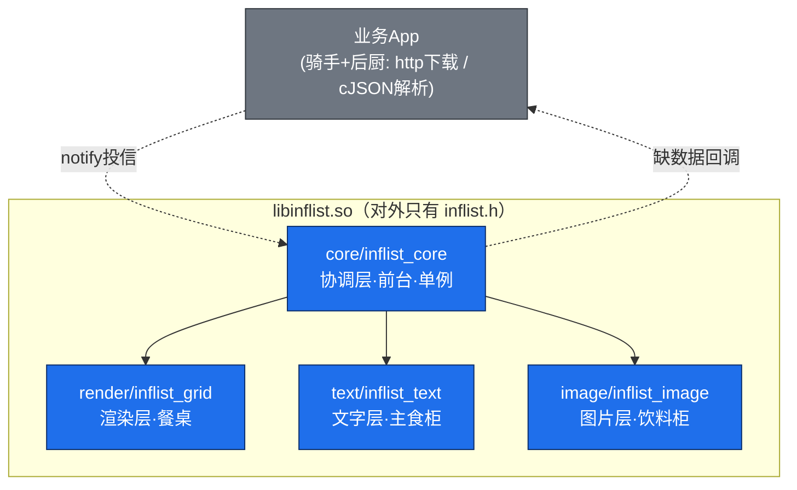
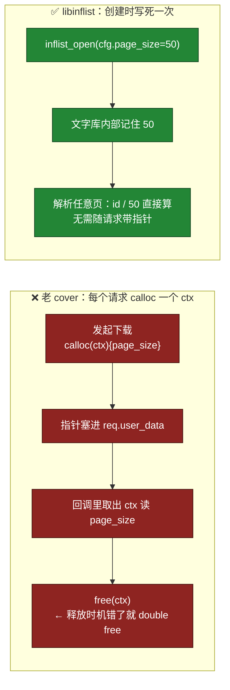
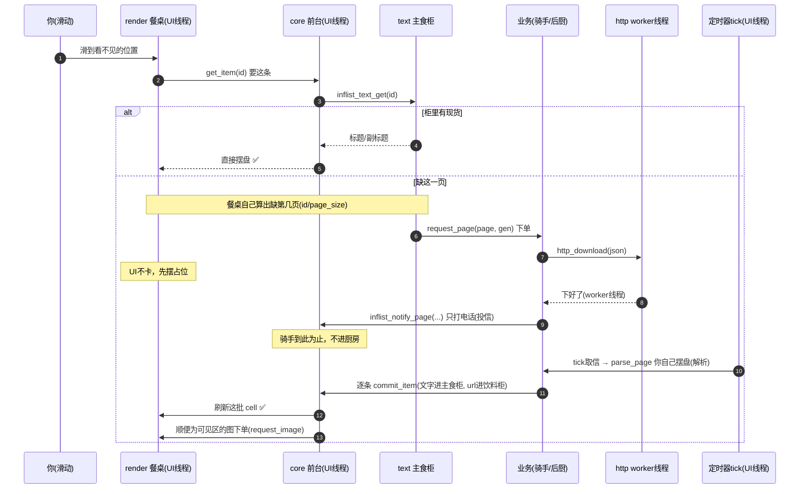
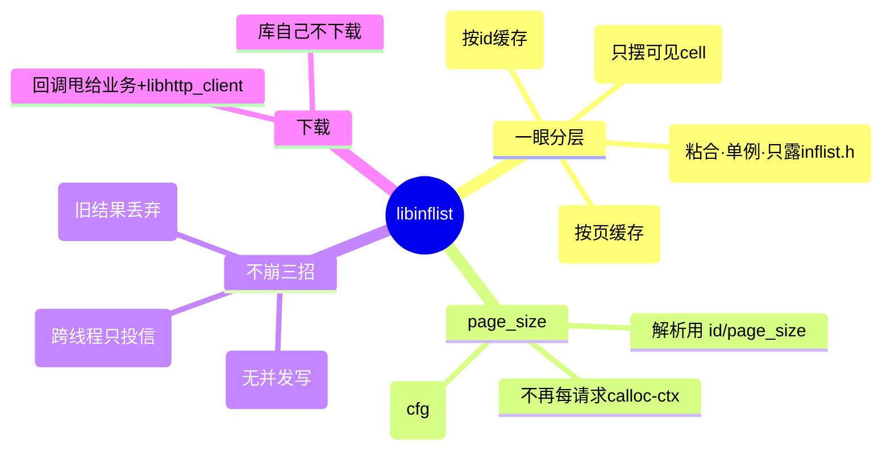

# 图解 · 一眼看懂分层与外卖比喻

面向第一次读 `libinflist` 的人。配合 [数据流与协作.md](数据流与协作.md)（更细的时序图）一起看。

> 渲染 Mermaid 需要支持的预览器（VS Code 装 Markdown Preview Mermaid Support，或 GitHub 直接看）。

---

## 1. 一眼认出「这是哪一层」

文件名前缀就是层，不用猜：

| 目录 / 文件 | 层 | 外卖比喻 | 一句话职责 |
|-------------|----|----------|------------|
| `render/inflist_grid.*` | **渲染层** | 餐桌 + 服务员 | 只摆「看得见的几个盘子」(cell)，滑动时复用，问上层要数据 |
| `text/inflist_text.*` | **文字层** | 主食柜 | 按页缓存标题/副标题，缺页就喊「下单」 |
| `image/inflist_image.*` | **图片层** | 饮料柜 | 按 id 缓存图片本地路径，缺图就喊「下单」 |
| `core/inflist_core.c` + `include/inflist.h` | **协调层** | 平台/前台 | 把上面三层粘起来；**对外只露 `inflist.h`** |
| 业务 App（不在库里） | 业务 | 骑手 + 后厨 | 真正用 `libhttp_client` 下载、用 cJSON 解析 |

记忆口诀：**`render` 摆盘，`text`/`image` 两个柜子各管各的，`core` 是前台，下载是外包给骑手。**

---

## 2. 关键：「一页多少条」在**创建时**传入，不用 ctx 指针

这是和老 `cover` 方案最大的区别，也是你直觉对的地方。

代码里就一处配置、一处使用：

- 配置：`inflist_cfg_t.page_size`（`inflist.h`）
- 使用：`page = id / page_size; off = id % page_size;`（`inflist_text_db.c`）

**好处**：没有「随请求生灭的小内存」，也就没有「谁 free、free 几次」的问题。代次失效靠 `generation`，不靠指针。

---

## 3. 外卖比喻（修正版完整流程）

你之前的比喻方向对，这里把两个反了的点改正：**①点哪页由「餐桌」算，不是骑手；②摆盘(解析)在你家(UI线程)做，骑手只放柜+打电话。**

> 退单/换店 = `reset`：代次 `gen++`。在途的旧外卖回来时单号(gen)对不上，**直接扔掉**，不会摆到新桌上 → 这就是不崩的根本。

---

## 4. 思维导图总览

---

## 5. 三句话记住

1. **分层看前缀**：`render` 摆盘、`text`/`image` 两个独立柜、`core` 前台。
2. **`page_size` 创建时给一次**，解析靠 `id / page_size`，不用 ctx 指针。
3. **回调只投信、解析在 UI 线程、代次丢旧货**——这三条让 `reset/close` 永不野指针。
