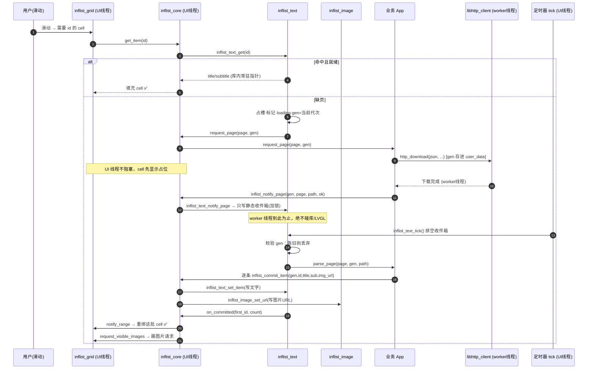
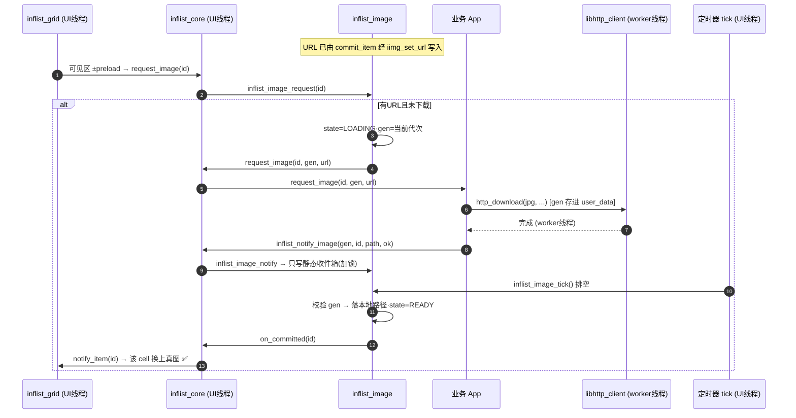
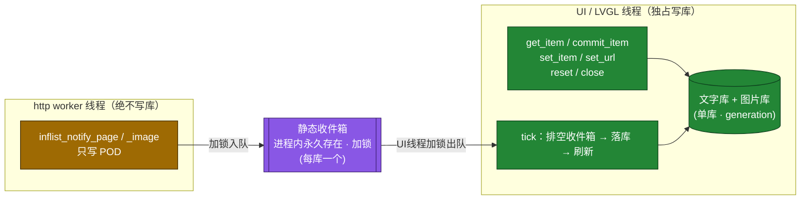
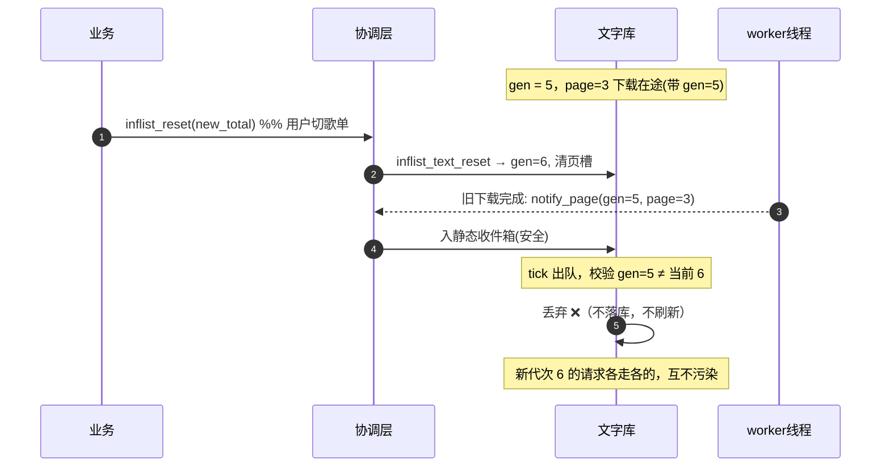
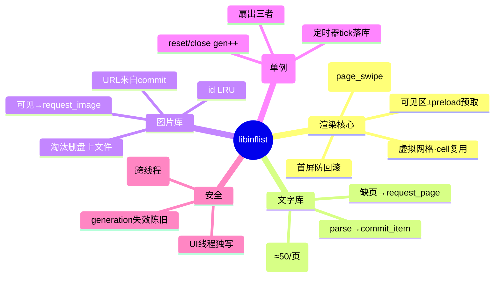

# libinflist 数据流与协作

本文用思维导图 / 时序图说明各模块如何协作、JSON 与图片如何从「滑动」一路流到「刷新 cell」，以及 `reset`/`close` 为什么不会野指针。

> 渲染图需要支持 Mermaid 的预览器（VS Code 装 Markdown Preview Mermaid Support，或 GitHub 直接渲染）。

---

## 1. 模块分层（谁依赖谁）

```mermaid
graph TD
    APP["业务 App<br/>(拼 URL / cJSON 解析 / http 下载)"]
    subgraph LIB["libinflist.so"]
        CORE["core/ inflist_core<br/>单例 · 扇出 · 定时器 tick"]
        GRID["render/ inflist_grid<br/>虚拟网格 · cell 复用 · 滑动/翻页/点击"]
        TXT["text/ inflist_text<br/>页 LRU · generation · 静态收件箱"]
        IMG["image/ inflist_image<br/>id LRU · generation · 静态收件箱"]
    end
    HTTP["libhttp_client.so"]
    LVGL["liblvgl.so"]

    APP -->|inflist_open/reset/close<br/>commit_item / notify_*| CORE
    CORE --> GRID
    CORE --> TXT
    CORE --> IMG
    GRID -->|lv_obj_*| LVGL
    CORE -->|回调 request_page/image| APP
    APP -->|http_download| HTTP
    HTTP -->|完成回调(worker线程)| APP

    classDef lib fill:#1f6feb,stroke:#0b2e6b,color:#fff;
    classDef ext fill:#6e7681,stroke:#30363d,color:#fff;
    class CORE,GRID,TXT,IMG lib;
    class HTTP,LVGL,APP ext;
```

要点：
- **文字库与图片库互不引用**（互不 include），只由协调层粘合。
- 库**自己不下载**：缺数据时回调业务，业务用 `libhttp_client` 下载。
- 渲染核心**不认识业务**，只通过 `ops` 回调向协调层取数据。

---

## 2. JSON 文字流（从滑动到刷新）



---

## 3. 图片流（与文字流并行、独立）



LRU 淘汰：图片库槽位满时淘汰最久未用的 READY 槽，并回调 `remove_file` 删掉盘上文件，控制磁盘占用。

---

## 4. 线程与安全模型（为什么 reset/close 不崩）



三道防线：
1. **静态收件箱**：跨线程通知只把 POD 拷进进程内永久存在的 static 队列，**绝不触碰库内容或 LVGL 对象**。即使 `close` 之后、`http_cancel_pending()` 漏网的回调迟到，也只是往常驻内存写一条信 → 安全。
2. **generation 代次**：`reset`/`close` 让两库 `gen++`；`tick` 落库前校验 gen，**陈旧下载结果直接丢弃**（取代「双数据库来回切」）。
3. **UI 线程独写**：所有库写入只在 UI 线程串行发生，worker 从不写库 → 无并发写、无需双缓冲。

> 对照 `libhttp_client/src/guard/http_ud_guard`：那用「守护+releaser」给 `user_data` 兜底；这里用「静态收件箱+generation」给数据库兜底，思路一致——**让迟到回调永远指向有效内存**。

---

## 5. reset / close 时的 generation 失效



`close` 同理：先 `reset`(gen++) 再 `destroy`，在途回调即便正好到达也被 gen 丢弃；句柄释放后到达的通知只进静态收件箱，下次 `open` 时排空。

---

## 6. 一句话总览


