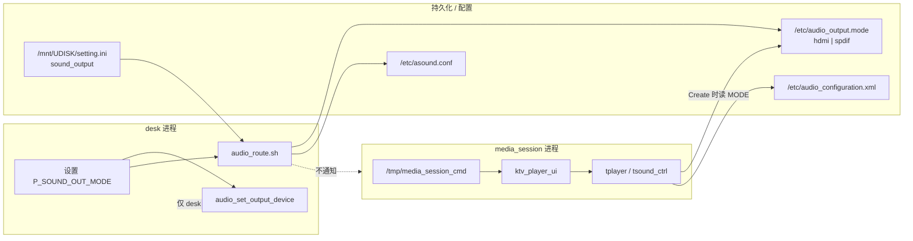

# libaudioroute 音频路由 — 架构说明

| 项 | 内容 |
|---|---|
| 日期 | 2026-08-22 |
| 适用范围 | H133-AIKTV **libaudioroute** 方案（JL_M101 首验；ZS101 等仍走 ALSALIB 旧路） |
| 目的 | 后续优化路由同步、透传、多进程一致性时的参照 |
| 关联 | [透传落地](./20260822-libaudioroute-HDMI透传落地/开发记录.md)、[设置切换待修](./20260822-设置切换后播放器路由不同步.md) |

---

## 1. 总览：两套并行出口

JL_M101 上同时存在 **两条互不自动同步** 的播放通路：

```
┌─────────────────────────────────────────────────────────────────────────┐
│                         用户 / 设置 UI                                   │
│              sound_output: 0=喇叭(SPDIF)  1=HDMI/ARC                     │
└───────────────────────────────┬─────────────────────────────────────────┘
                                │
          ┌─────────────────────┴─────────────────────┐
          ▼                                           ▼
┌──────────────────────┐                 ┌──────────────────────────────┐
│ 通路 A：ALSA 默认路由  │                 │ 通路 B：libaudioroute + tplayer │
│ (aplay / 投屏 / 部分工具)│                 │ (media_sessiond / changba KTV) │
└──────────────────────┘                 └──────────────────────────────┘
          │                                           │
          ▼                                           ▼
   /etc/asound.conf                          audio_configuration.xml
   + audio_route.sh                           + tsound_ctrl.c
          │                                           │
          ▼                                           ▼
   PlaybackSPDIF / PlaybackHDMI                OUT_SPK / OUT_HDMI_ARC
          │                                           │
          ▼                                           ▼
      sndowa / sndi2s2                         TinyAlsa pcm + amix
```

**优化要点**：改设置时必须让 A、B 两条通路 **同一时刻指向同一物理声卡**；当前 B 在运行中不会自动跟 A。

---

## 2. 进程与单例边界

| 进程 | 二进制 | Audio HAL | `current_device_type` | 读 mode 文件时机 |
|------|--------|-----------|----------------------|------------------|
| **desk** | `lv_projector` / desk | 独立 `AudioManager` | 进程内全局（`audio_hw.cpp`） | 不读（靠 `audio_api.c` 直接 `adev_set`） |
| **media_session** | `media_sessiond` | 独立 `AudioManager` | **另一份**全局 | **`TSoundDeviceCreate` 时**读 `/etc/audio_output.mode` |
| **amix 服务** | 系统 daemon | — | — | 按 `OUT_*` 字符串开流 |
| **parm_server** | 音效/音量 | — | — | 按 `OUT_HDMI_ARC` 等加载 volume XML |



---

## 3. 设置切换数据流（当前实现）

### 3.1 desk 侧（立即生效）

文件：`desk/setting/core/desk_setting_param.c`

```
P_SOUND_OUT_MODE
  ├─ audio_set_output_device(value)     → audio_api.c
  │     SOUND_OUTPUT_SPEAKER(0) → OUT_SPK (2)
  │     SOUND_OUTPUT_ARC(1)     → OUT_HDMI_ARC (32)
  │     → adev_set_output_device()      → 音量曲线 parm_server
  │
  └─ desk_setting_apply_audio_route()
        → /usr/bin/audio_route.sh hdmi|spdif
              ├─ 写 /etc/audio_output.mode
              ├─ 改 asound.conf default playback.pcm
              └─ killall aplay
```

**未调用**：`ms_changba_reopen_sound_route()` → FIFO `REOPEN_SOUND`。

### 3.2 media_session 侧（仅建卡时对齐）

文件：`platform/.../tsound_ctrl.c`（`TPLAYER_AUDIO_API_LIBAUDIOROUTE`）

```
TSoundDeviceCreate()
  ├─ adev_open()
  ├─ syncAdevOutputRoute()          // 读 mode → adev_set_output_device（须在注册 callback 之前）
  ├─ adev_set_device_change_callback(handleAudioDeviceChange)
  └─ adev_create_audio_port_config(routeModeFileToSndDevice())
        hdmi → OUT_HDMI_ARC (32)
        spdif / 其它 → OUT_SPK (2)

TSoundDeviceStart()
  └─ openSoundDevice() → audio_port_open_device()   // 禁止内嵌 sync（mutex 死锁）

handleAudioDeviceChange()   // 同进程内 adev_set 触发；跨进程不会走到
  └─ 关设备 → 删 port → 按 new_device 重建 → STATUS_RESET
```

### 3.3 已有但未接线的恢复手段

| API | 路径 | 作用 |
|-----|------|------|
| `ms_changba_reopen_sound_route()` | desk → FIFO `REOPEN_SOUND` | 通知 media_session |
| `ktv_player_ui_reopen_sound_route()` | `ms_backend_ktv.c` | stop → 重建播放器 → 再 play |
| `TSoundDeviceReopenAllRoutes()` | `tsound_ctrl.c` | 关 port、按 mode 重建（**无外部调用方**） |

---

## 4. JL_M101 硬件 ↔ 逻辑设备映射

来源：`openwrt/.../JL_M101/.../audio_configuration.xml` + `asound.conf`

| UI / mode 文件 | libaudioroute `snd_type` | 声卡 | 物理用途 | ALSA pcm 别名 |
|----------------|--------------------------|------|----------|---------------|
| `spdif` / Speaker(0) | `OUT_SPK` (2) | **sndowa** card 2 | MCU 功放 / 板载光纤 | `PlaybackSPDIF` |
| （光纤独立项） | `OUT_OWA` (16) | sndowa | 同卡另一逻辑口 | 同左 |
| `hdmi` / ARC(1) | `OUT_HDMI_ARC` (32) | **sndi2s2** card 0 | HDMI PCM + IEC61937 透传 | `PlaybackHDMI` |

喇叭与 HDMI **必须分卡**：功放不在 I2S2 上，不能 SDK 式「全走 default」。

---

## 5. 播放时数据通路

### 5.1 PCM（AAC、MP3、解码后 stereo）

```
tplayer 解码 PCM
  → TSoundDeviceWrite (mNeedDirect=0)
  → EQ / Gain（可选）
  → AudioPortTinyAlsaConfig::process()
       direct_mode=0:
         amix_dev_do(OUT_HDMI_ARC | OUT_SPK, ...)
         → snd_pcm_writei(pcm)
  → 硬件：sndi2s2 或 sndowa
```

`openDevice()` 时：`amix_dev_open(audio_sound_type_to_string(snd_type), ...)`  
log 例：`amix_dev_open succeed device_type OUT_HDMI_ARC`。

### 5.2 杜比透传（AC3 / EAC3 / DTS）

```
player.c 识别编码
  → raw_data.nNeedDirect=1, nDataType=AC3/...
  → AudioDecCompCreate(1) → adecoderPassthough（不解 PCM）
  → TSoundDeviceSetFormat: period 1536, direct_mode=1
  → TSoundDeviceWrite:
       sunxi_passthough_process() → IEC61937 帧
  → AudioPortTinyAlsaConfig::process()
       direct_mode=1:
         snd_pcm_writei 直写（绕过 amix）
  → sndi2s2 → 电视解码
```

**前提**：`OUT_HDMI_ARC` + `sndi2s2`；若误绑 `OUT_SPK`，透传比特流进 MCU，电视无声。

### 5.3 与 ALSALIB 旧方案对比（ZS101 / 8733）

| 项 | ALSALIB（旧） | LIBAUDIOROUTE（JL 杜比方案） |
|----|---------------|------------------------------|
| 路由来源 | `tsound` 读 `audio_output.mode`，直 `snd_pcm_open("PlaybackHDMI")` | `adev` + `audio_configuration.xml` |
| 跨进程 | 每进程自己 open ALSA 名 | 每进程独立 `AudioManager`，靠 mode 文件对齐 |
| 透传 | 自有 spdif 线程 + ring | `sunxi_passthough` + `direct_mode` |
| 音量/EQ | 较少走 amix | amix + parm_server 按 `OUT_*` |

---

## 6. 关键文件索引

| 层级 | 路径 | 职责 |
|------|------|------|
| UI | `desk/setting/core/desk_setting_param.c` | 设置入口；应补 `REOPEN_SOUND` |
| desk HAL | `desk/.../audio/audio_api.c` | UI mode → `OUT_*` |
| 路由脚本 | `openwrt/.../usr/bin/audio_route.sh` | mode 文件 + asound 默认 pcm |
| 持久化 | `/mnt/UDISK/setting.ini` `[sound] sound_output` | 开机默认值 |
| 运行时 | `/etc/audio_output.mode` | tplayer **唯一跨进程契约**（当前） |
| 板级映射 | `.../etc/audio_configuration.xml` | `OUT_*` → card/rate/period |
| ALSA 别名 | `.../etc/asound.conf` | aplay / 投屏 |
| 播放器声卡 | `libtmedia/.../tsound_ctrl.c` | Create/Start/Write/透传 |
| HAL 实现 | `libaudioroute/audio_hw.cpp` | `adev_*`、`current_device_type` |
| 端口 IO | `libaudioroute/AudioPortTinyAlsaConfig.cpp` | pcm_open、amix、direct_mode |
| 透传编码 | `libtmedia/.../spdif/SunxiPassthough.cpp` | AC3 → IEC61937 |
| 解码识别 | `libcedarx/.../player.c` | `nNeedDirect` |
| IPC | `lib/media_session/client/changba/ms_client_changba.c` | FIFO 客户端 |
| 重建路由 | `lib/media_session/src/pro/ktv_player_ui.c` | `ktv_player_ui_reopen_sound_route` |
| 编译开关 | `openwrt/.../JL_M101/defconfig` | `CONFIG_TR_AUDIO_API_LIBAUDIOROUTE=y` |

---

## 7. 状态机（tsound / LIBAUDIOROUTE）

```
STATUS_STOP ──TSoundDeviceStart──► STATUS_START
     ▲                                  │
     │                                  │ TSoundDevicePause
     │                                  ▼
     │                            STATUS_PAUSE
     │
     │ handleAudioDeviceChange（同进程）
     └──────── STATUS_RESET ──Write/Start──► STATUS_START

TSoundDeviceWrite: STATUS_STOP/PAUSE → 直接丢弃音频
```

`closeDevice()` 内含 `usleep(1s)`（TinyAlsa 实现），频繁切路由会拖慢且易卡中间态。

---

## 8. 已知缺口（优化 backlog）

| # | 问题 | 影响 | 建议方向 |
|---|------|------|----------|
| 1 | 设置切换不触发 `REOPEN_SOUND` | 运行中 HDMI↔SPDIF 播放器不跟切 | `desk_setting_param.c` 调 `ms_changba_reopen_sound_route()` |
| 2 | mode 文件仅在 `Create` 读 | 不重播则不重建声卡 | 或 `Start` 前比对 mode 与当前 port，变则 `TSoundDeviceReopenAllRoutes` |
| 3 | desk / media_session 双份 `current_device_type` | 音量/EQ 可能按错设备 | 统一以 mode 文件或单进程 routing 服务为准 |
| 4 | `handleAudioDeviceChange` 与 `mutex` | 在 `openSoundDevice` 内 sync 会死锁 | 禁止持锁回调；用 REOPEN 或异步 |
| 5 | A/B 通路配置重复 | asound 与 xml 两套映射 | 文档化约定；长期可只保留一条主通路 |
| 6 | `OUT_OWA` vs `OUT_SPK` | UI Speaker 映射 SPK 非 OWA | JL 上均 sndowa，一般无妨；光纤专用需确认 |
| 7 | amix 与 direct_mode | 透传必须 direct；PCM 依赖 amix | 切换格式时 `SetFormat` 已关设备重配 |
| 8 | 开机 `audio_route.sh auto` | 是否随 setting.ini 写 mode | 启动脚本需与 ini 一致 |

---

## 9. 优化验收清单（建议）

1. **冷启动**：ini=HDMI → 播 AC3 → `snd_type=32`，`card=0`，电视有声  
2. **运行中切 SPDIF**：不停进程 → 再播 → `card=2`，喇叭有声  
3. **再切回 HDMI**：不停进程 → 再播 AC3 → 恢复 `card=0`，透传正常  
4. **aplay**：`aplay test.wav` 与 tplayer 同设置走同一物理口  
5. **log**：设置切换时出现 `REOPEN_SOUND` / `reopen sound route`（修 #1 后）

---

## 10. 调试命令

```bash
# 当前路由
cat /etc/audio_output.mode
grep sound_output /mnt/UDISK/setting.ini
/usr/bin/audio_route.sh show

# 手动切（与设置等价）
/usr/bin/audio_route.sh hdmi    # 或 spdif

# 强制播放器重建声卡
echo REOPEN_SOUND changba > /tmp/media_session_cmd

# 看声卡
cat /proc/asound/cards
```

关键 log 关键字：`adev_set_output_device`、`snd_type`、`pcm_open dstPortConfig`、`amix_dev_open`、`direct_mode`、`sunxi_passthough_open`。
