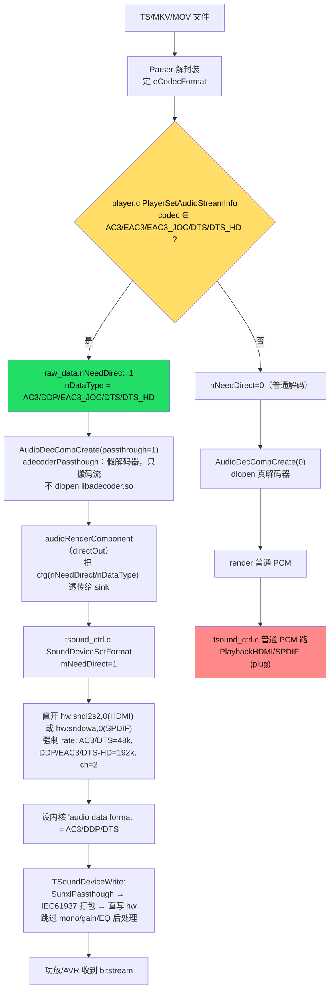
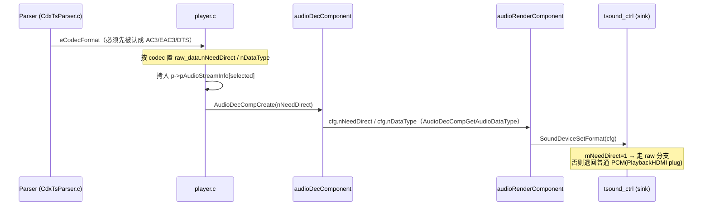

# 杜比/DTS HDMI·SPDIF 透传 开发笔记

> 目标：在 `p1_nor_JL_DOLBY` build 上，把**未解码**的 Dolby(AC3/EAC3/EAC3-JOC)与 DTS/DTS-HD 码流，经 IEC61937 打包后从 **HDMI(i2s2)** 或 **SPDIF(owa)** 直通给功放/AVR，同时保证画面正常显示。单路由输出（HDMI 或 SPDIF 二选一，不同时）。

---

## 1. 一句话现状

链路代码（parser 认 EAC3 → player 置透传标志 → 假解码器搬码流 → render 直出 → sink 做 IEC61937 打包直写 hw + 设内核 `audio data format` 控件）**在源码里已经全部打通**；HDMI 硬件经 `aplay` 实测能吃 48k/192k S16 立体声。但实机放 `Xiaokaiye_Atmos.ts` **没声音**，真正断点尚未用运行时打印定位（需再编一版拿 `[RAWPT]` 日志）。

---

## 2. 硬件/环境事实（实测）

| 项 | 结论 | 依据 |
|---|---|---|
| ALSA 声卡 | `sndi2s2`(HDMI)、`audiocodec`、`sndowa`(SPDIF) | `cat /proc/asound/cards` |
| HDMI 直写 48k S16 立体声 | ✅ 成功 | `aplay -D hw:sndi2s2,0 -f S16_LE -r 48000 -c 2` → `HDMI Audio enable successfully` |
| HDMI 直写 192k S16 立体声 | ✅ 成功 | 同上 `-r 192000` 也成功（EAC3/DDP 透传需 192k 载体） |
| 内核 HDMI 音频格式控件 | `amixer -c sndi2s2` 的 **`audio data format`**（枚举：1=PCM,2=AC3,7=DTS,10=DOLBY_DIGITAL_PLUS,11=DTS_HD…） | `sunxi_v2` 驱动，非旧版 `hdmi audio format Function` |
| 音频后端 | **ALSALIB**（非 libaudioroute） | `defconfig`: `CONFIG_TR_AUDIO_API_ALSA_LIB=y` |
| 路由选择 | `/etc/audio_output.mode`（`hdmi`/`spdif`）+ `/etc/asound.conf` 的 `PlaybackHDMI`/`PlaybackSPDIF`(plug) | rootfs 实际文件 |

---

## 3. 整体架构 / 数据流



### 3.1 透传开关 `nNeedDirect` 传递链（命脉）



### 3.2 模块分层与仓库位置

```mermaid
flowchart LR
    subgraph L1["libcedarx（解码前端，源码可改）"]
        direction TB
        p1["parser/ts/CdxTsParser.c<br/>PMT/descriptor 认 EAC3"]
        p2["parser/ts/MediaProbe.c<br/>probe_ac3: 0x0B77 syncword 嗅探兜底"]
        p3["playback/player.c<br/>置 nNeedDirect/nDataType"]
        p4["playback/audioDecComponent.{c,h}<br/>AudioDecCompCreate(int)+GetAudioDataType"]
        p5["playback/adecoderPassthough.c<br/>假解码器"]
        p6["playback/audioRenderComponent.c<br/>directOut"]
        p7["external/include/adecoder/adecoder.h<br/>EAC3/EAC3_JOC/DTS_HD 枚举 + AUDIO_RAW_DATA_*"]
    end
    subgraph L2["libtmedia（音频输出 sink，源码可改）"]
        direction TB
        s1["tplayer/awsink/tsound_ctrl.{c,h}<br/>raw 分支：直开hw+设控件+IEC直写"]
        s2["tplayer/awsink/spdif/*.cpp<br/>SPDIFEncoder/SunxiPassthough/wrapper<br/>IEC61937 打包"]
        s3["tplayer/Makefile + openwrt 包 Makefile<br/>C/C++ 混编、传 CXX"]
    end
    L1 --> L2
    L2 --> HW["ALSA hw: sndi2s2(HDMI) / sndowa(SPDIF)"]
```



---

## 4. 改动清单

### 阶段 A — libcedarx（解码前端）
- `external/include/adecoder/adecoder.h`：新增 `AUDIO_CODEC_FORMAT_EAC3/EAC3_JOC/DTS_HD` 及 `AUDIO_RAW_DATA_EAC3_JOC` 等枚举。
- `libcore/parser/ts/CdxTsParser.c`：EAC3 识别（PMT `stream_type`、parsePES、descriptor）。**注：本文件在工程里是有源码的（6987 行），一度误判为“无源码/预编译”，实为大文件 grep 假阴性。**
- `libcore/parser/ts/MediaProbe.c`：`probe_ac3` 用 syncword `0x0B77`+bsid 嗅探 AC3/EAC3 兜底（参考 `cedarx.diff`）。
- `libcore/playback/player.c`：`PlayerSetAudioStreamInfo` 按 `eCodecFormat` 置 `raw_data.nNeedDirect/nDataType`；`PlayerInitialAudio` 用 `nNeedDirect` 传参 `AudioDecCompCreate`。
- `libcore/playback/audioDecComponent.{c,h}`：`AudioDecCompCreate(int isNeedDirect)`；新增 `AudioDecCompGetAudioDataType`；passthrough 分支（`memcpy adec_passth`，不 dlopen 真解码器）。
- `libcore/playback/adecoderPassthough.c`：新增“假解码器”，只把码流入队；`Makefile.am` 收录。
- `libcore/playback/audioRenderComponent.c`：directOut 链路（读 dataType/needDirect → cfg → `SoundDeviceSetFormat`）。

### 阶段 B — libtmedia（音频输出 sink，ALSALIB）
- `tplayer/awsink/tsound_ctrl.{c,h}`：
  - `SoundCtrlContext` 加 `passth / raw_type / mNeedDirect / raw_dev_open`。
  - `TSoundDeviceCreate` 初始化 `sunxi_passthrough_create`。
  - `TSoundDeviceSetFormat`：raw 分支置 `mNeedDirect=1`、`raw_type`，强制 rate（AC3/DTS=48k，DDP/EAC3/DTS-HD=192k）、ch=2。
  - `TSoundDeviceStart`：raw/PCM 切换时重开设备（`hw:sndi2s2,0`/`hw:sndowa,0` vs plug），`sunxi_passthough_open` + `setAudioDataFormatCtl`；重开时保存/恢复 `pcm_in_channels`。
  - `TSoundDeviceWrite`：raw 分支 `sunxi_passthough_process` 打包后 `writePcmWithRecover` 直写，跳过后处理。
  - `TSoundDeviceStop/Destroy`：复位 `audio data format`=PCM，关闭并重建 passth。
  - 修复 `SunxiPassthough` 析构未释放（内存泄漏）。
- `tplayer/awsink/spdif/*.cpp`：SPDIFEncoder/SunxiPassthough/wrapper 编入 tplayer。
- `tplayer/Makefile`：新增 C++ 源/对象/依赖规则，链接改用 `$(CXX)`。
- `openwrt/.../libtmedia/Makefile`：`tplayer` make 传 `CXX="$(TARGET_CXX)"`。

### 诊断打印（`[RAWPT]`，输出到 stderr，始终打印）
- `player.c`：`audio stream[i] eCodecFormat=0x?`；`create dec: needDirect/dataType/codec`。
- `tsound_ctrl.c`：`SetFormat type/rate`、`pcm_open <dev> ok/FAIL`、`hw_params ok/FAIL rate/ch/fmt`、`set 'audio data format'=N ok/FAIL`、`Start raw route/type/dev`、`write in/iec/frames/res`。

---

## 5. 与全志参考包（`透传/透传/`）的对照

- `cedarx.diff`：EAC3 枚举、mkv/mov/**ts** parser 认 EAC3、MediaProbe 嗅探、player/decoder/render 透传链——我们的阶段 A 与之对齐。
  - **差异**：参考里有 TS **descriptor `0x87`(EAC3 audio descriptor)** 与 registration `EAC3` 分支；本工程 `CdxTsParser.c` 里这两处**未打上**（仅有 `stream_type` 直判 + descriptor 0x81/0x7A）。若某 .ts 用 0x87 descriptor 标 EAC3，可能漏判。
- `tsound_ctrl.diff` / `libaudioroute.diff`：sink 侧 IEC 打包与直写，针对 **libaudioroute**；我们是 **ALSALIB**，思路移植到 `tsound_ctrl.c`。
- `spdif/`：`SPDIFEncoder / SunxiPassthough / *_wrapper` 即 IEC61937 打包三件套，直接编入 tplayer。

---

## 6. 关键坑与教训

1. **并行 configure 竞态 → 机器 thrashing（严重）**：`mmo libcedarx -B` 清掉 `.configured` 后，`m -j$(nproc) world` 阶段 `cedarx` 与 `libcedarx` 两个包**并行在同一 `build_dir/target/cedarx` 跑 configure**，互删 `conftest.c` → `C preprocessor "arm-openwrt-linux-gcc -E" fails sanity check`；`-j$(nproc)` 还把内存打爆，`uptime` 都要 40s+。
   - **安全编法**：**不加 `-B`**（保留 configure，避免竞态）；`mmo <pkg>` 本身串行（无 -j）；整包 `m` 用 **低并发 `-j2`/`-j1`**。只改了源文件时优先增量。
   - 若已被 `-B` 破坏，先串行 `mmo libcedarx` 重新配好，再 `m -j2 && p`。
2. **大文件 grep 假阴性**：对 6987 行的 `CdxTsParser.c` 及整目录 grep 偶发“未找到”实为超时/截断，导致一度误判“TS 无源码”。**结论要以精确路径的二次核实为准。**
3. **本 build 无 Dolby 软解**：启动只加载 aac/mp3/flac/wav/ape/alac 解码插件，**没有 AC3/EAC3 解码器**——所以透传是唯一出声路径；一旦 `nNeedDirect` 没置上退回普通路，必然静音。
4. **HDMI 比 SPDIF 严格**：HDMI 需正确 InfoFrame / N-CTS（靠 `audio data format` 控件），SPDIF 常可被 AVR 自适应。
5. **禁止在 WSL/x86 源码树本地 `make`/`gcc -c`**（会留 x86 `.o` 污染交叉编译）；语法自检只读 log。

---

## 7. 待办 / 下一步

1. **拿运行时 `[RAWPT]` 打印定位**（需安全编一版 libcedarx + 打包）：
   - 看 `eCodecFormat`：`0x5`=AC3 / `0x20`=EAC3 / `0x21`=EAC3_JOC / `0x4`=AAC / `0x0`=UNKNOWN。
   - 看 `create dec: needDirect=?`：透传开关是否打开。
2. 按打印分流：
   - codec 是 AC3/EAC3 但 `needDirect=0` → 标志传递链有 bug（源码可修）。
   - codec 是 AAC/UNKNOWN → 该 .ts 靠 descriptor 标 EAC3，补 `CdxTsParser.c` 的 **0x87 / registration EAC3** 分支（参考 `cedarx.diff`），或用 `MediaProbe.probe_ac3` 嗅探。
   - 选中音轨不对 → 检查 `nAudioStreamSelected`（多音轨时可能选了非杜比轨）。
3. HDMI 若因 192k 不排空而卡，考虑 N/CTS 或 EAC3 走 HBR/降级。

---

## 8. 快速定位命令（设备侧）

```sh
cat /proc/asound/cards
# 测 HDMI i2s2 载体（先确保没有在播、设备不被占）
aplay -D hw:sndi2s2,0 -f S16_LE -r 48000  -c 2 -d 3 /dev/urandom
aplay -D hw:sndi2s2,0 -f S16_LE -r 192000 -c 2 -d 3 /dev/urandom
# 内核 HDMI 音频格式控件
amixer -c sndi2s2 controls | grep -i 'audio data format'
# 放 Atmos.ts 后抓透传日志
# 关注串口里所有 [RAWPT] 行
```
