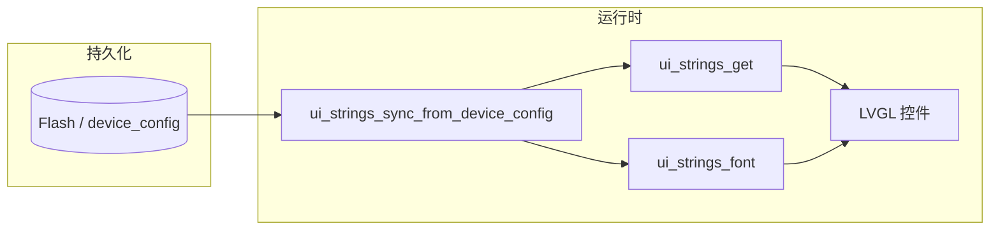

# BK7252n 上 LVGL 多语言界面开发指南

本文档说明本 SDK 工程中 **21 种界面语言**（语言 ID `0`～`20`）与 **LVGL 字体、文案表、持久化与切换入口** 的对接方式，便于后续维护与扩展。

---

## 1. 总体架构

多语言由三层协作完成：

1. **持久化语言 ID**：`device_config` 将 `language_id` 写入 Flash，与 MQTT/串口配置共用同一套逻辑。
2. **文案表**：`applications/pages/ui_strings.c` 中的二维表 `s_tbl[语言][文案枚举]`，全部为 **UTF-8** 字符串。
3. **字体选择**：`ui_strings_font()` 根据当前语言返回不同的 `lv_font_t *`，避免拉丁子集字体显示中文、泰文、阿拉伯文等缺字。

界面代码（如 `lv_example_meter.c`）通过 `ui_strings_get(id)` 取字符串，通过 `ui_strings_font()` 设置 `lv_label` 等控件的字体。



---

## 2. 语言 ID 与 ISO 代码对照

语言顺序必须与 `applications/mqtt_backend/device_config.c` 中 `g_device_lang_table[]` **完全一致**（下标即语言 ID）：

| ID | 代码 |
|----|------|
| 0 | zh-Hans |
| 1 | zh-Hant |
| 2 | en |
| 3 | ko |
| 4 | fr |
| 5 | es |
| 6 | th |
| 7 | ar |
| 8 | ru |
| 9 | de |
| 10 | it |
| 11 | pt |
| 12 | vi |
| 13 | el |
| 14 | ja |
| 15 | pl |
| 16 | tr |
| 17 | nl |
| 18 | cs |
| 19 | he |
| 20 | uk |

`applications/pages/ui_strings.h` 中的 `UI_LANG_COUNT`（21）与 `UI_STR_*` 枚举顺序需与产品文案一一对应；**增删语言或调整顺序**时，必须同时改 `g_device_lang_table`、`ui_strings.c` 中的 `s_tbl` 行顺序，以及 MQTT/Shell 校验范围（当前上限为 `20`）。

---

## 3. 文案表：`ui_strings.c` / `ui_strings.h`

### 3.1 枚举与条数

- `ui_str_id_t`：每条 UI 文案一个枚举值（录音标题、错误提示、模式名称、页脚格式串等）。
- `UI_STR_COUNT`：每种语言的字符串个数；`s_tbl` 每一行必须有 **恰好** `UI_STR_COUNT` 个 `"..."` 字面量。
- 含格式化占位符的字符串（如 `UI_STR_PRINT_FOOTER_FMT`）使用 `rt_snprintf` / `lv_label` 等与 LVGL 一致的写法，注意 **`%lu`** 等与类型匹配。

### 3.2 编码要求

- 源文件必须使用 **UTF-8（无 BOM）**。
- 省略号建议使用 Unicode 字符 **U+2026（…）**，不要使用会被破坏的多字节序列（历史上若把 UTF-8 尾字节替换成 `?`，会导致整文件解码失败）。
- 修改后用编辑器或 `python3 -c "open('...').read().decode('utf-8')"` 做一次 strict 解码检查。

### 3.3 API

- `ui_strings_sync_from_device_config()`：从 `device_config` 读取语言 ID，写入内部 `s_ui_lang`。
- `ui_strings_get(ui_str_id_t id)`：返回当前语言下的 UTF-8 字符串指针。
- `ui_strings_font(void)`：返回当前语言应使用的 `const lv_font_t *`。

初始化 UI 时以及切换语言后，应先 `sync` 再刷新界面（见第 5 节）。

---

## 4. 字体策略（为何不止一种字体）

嵌入式 LVGL 通常使用 **位图字体（lv_font_fmt_txt）**，每种字体只在编译期编入一部分字形。若只用 Montserrat 14 的默认子集（基本 ASCII + 少量符号），则 **法语变音、德语变音、西里尔、希腊、越南语、泰语** 等都会缺字或显示异常。

本工程采用 **按语言分支** 的策略（`ui_strings_font()`）：

| 语言 ID | 场景 | 字体 |
|---------|------|------|
| 7、19 | 阿拉伯语、希伯来语（RTL/Bidi） | `lv_font_dejavu_16_persian_hebrew`（16px） |
| 0、1、3、14 | 简中、繁中、韩、日 | `lv_font_simsun_16_cjk`（16px，实为按文案子集生成的合并字体） |
| 其余 | 拉丁扩展、西里尔、希腊、越南语、泰语等 | `lv_font_ui_i18n_14`（14px，DejaVu Sans + 泰文 Loma 合并子集） |
| （回退） | `LV_FONT_UI_I18N_14` 关闭时 | `lv_font_montserrat_14` |

说明：

- **阿/希**：依赖 `lv_conf.h` 中 `LV_FONT_DEJAVU_16_PERSIAN_HEBREW`、`LV_USE_BIDI`、`LV_USE_ARABIC_PERSIAN_CHARS` 等配置。
- **CJK 四语**：日韩与中文共用一条 CJK 字体路径时，字体文件必须覆盖 **这几语言行中出现过的所有字符**。
- **其余欧洲/东南亚等**：由 `lv_font_ui_i18n_14` 覆盖；泰文在常见 TTF 里往往不在 DejaVu 正文中，故生成脚本用 **Loma** 补充泰文区段。

全局默认字体仍为 `LV_FONT_DEFAULT &lv_font_montserrat_14`；仅 **显式设置了 `ui_strings_font()` 的控件** 会走多语言字体，其它界面元素若要国际化需自行设字体或改用默认。

---

## 5. 运行时切换与 LVGL 线程

### 5.1 同步语言索引

任意时刻若 Flash 中的 `language_id` 可能已变，应调用：

```c
ui_strings_sync_from_device_config();
```

### 5.2 刷新桌面 UI

语言切换后必须 **在 LVGL 语境下** 重建依赖文案的控件，否则仅更新索引字符串指针不够。

本工程实现：`applications/pages/lv_example_meter.c` 中的 `lv_desktop_refresh_language()` 通过 `lv_async_call` 调度 `language_refresh_async_cb`，在回调里：

1. `lv_vendor_disp_lock()`
2. `ui_strings_sync_from_device_config()`
3. 清空模式槽位、`voice_panel_rebuild()`、刷新桌面中心区域
4. `lv_vendor_disp_unlock()`

切换入口示例：

- **串口 MSH**：`device_config.c` 中的 `cfglang`（无参数打印帮助与当前语言；带参数则 `device_config_set_language` + `lv_desktop_refresh_language()`）。
- **MQTT**：`mqtt_backend_message.c` 中 `languageSwitch` 命令，校验 `language` 为 `0`～`20`，写入配置后调用 `lv_desktop_refresh_language()`。

### 5.3 LVGL 任务栈

长文案 + 复杂布局可能在切换语言时增加栈消耗。若出现 `data abort` / 栈溢出，可适当增大 `beken378/app/lvgl/lv_vendor.c` 中与 LVGL 任务相关的栈配置（本工程曾将相关栈调至更大以规避此类问题）。

---

## 6. 编译工程

本仓库推荐使用：

```bash
scons --beken=bk7252n -j8
```

字体 `.c` 较大时编译时间会增加；确保 `beken378/SConscript` 已包含新增的字体源文件（如 `lv_font_ui_i18n_14.c`、`lv_font_simsun_16_cjk.c`）。

---

## 7. 字体生成与维护

### 7.1 工具：lv_font_conv

使用 LVGL 官方 Node 工具 **[lv_font_conv](https://www.npmjs.com/package/lv_font_conv)**（仓库内通过脚本调用 `lv_font_conv.js`）。

典型依赖：

- **Node.js**（`node` 在 `PATH` 中，或通过环境变量 `NODE_BINARY` 指定）。
- 解压后的包路径可通过环境变量 **`LV_FONT_CONV_JS`** 指向 `lv_font_conv.js`。

说明：**`.ttc`（TrueType Collection）** 常被 `lv_font_conv` 使用的 opentype 栈拒绝；优先使用 **`.ttf`**（如系统自带的 `DejaVuSans.ttf`、`tlwg` 的 `Loma.ttf`）。

### 7.2 `lv_font_ui_i18n_14`（多数欧洲语言 + 希腊 + 西里尔 + 越南语 + 泰语等）

脚本路径：

```text
tools/scripts/gen_lv_font_ui_i18n_14.py
```

作用：从 `ui_strings.c` 中 **指定语言行**（与 `device_config` 中走「非 DejaVu、非 CJK」的语言 ID 一致）抽取全部字符，拆成：

- **非泰文**：`DejaVuSans.ttf` + `-r 0x20-0x7f` + `--symbols …`
- **泰文（U+0E00～U+0E7F）**：`Loma.ttf` + `--symbols …`

两次 `--font` 合并生成 `beken378/app/lvgl/src/font/lv_font_ui_i18n_14.c`。

在工程根目录执行：

```bash
export LV_FONT_CONV_JS=/path/to/package/lv_font_conv.js   # 若默认路径不存在
python3 tools/scripts/gen_lv_font_ui_i18n_14.py
```

可选环境变量：`DEJAVU_SANS_TTF`、`LOMA_TTF`。

**何时必须重跑**：修改了上述语言行文案，且引入了 **新的 Unicode 字符**（新词、新标点、另一种字母）。

### 7.3 `lv_font_simsun_16_cjk`（简繁日韩）

当前文件名为历史沿用（`simsun`），内容为 **按 UI 文案子集裁剪的 CJK 字体**（来源可为 Noto/Droid 等 TTF，视生成命令而定）。

**何时必须重跑**：修改语言 **0、1、3、14** 任意一行文案并引入新汉字/假名/谚文音节等。

操作建议：

1. 从 `ui_strings.c` 中提取这四行全部字符串中的 **去重字符集合**。
2. 使用 `lv_font_conv`：`--font <某 CJK 覆盖充分的 .ttf>`，`-r 0x20-0x7f`，`--symbols <去重字符串>`，生成 `.c` 后替换 `lv_font_simsun_16_cjk.c`（保持 `lv_font_simsun_16_cjk` 符号名与 `lv_conf` 开关一致）。
3. 通过 Python `subprocess` 传入 `--symbols`，避免 shell 破坏 UTF-8。

### 7.4 `lv_font_dejavu_16_persian_hebrew`

一般为范围编译（阿拉伯、希伯来区块 + ASCII）。若阿/希文案新增罕见字符，需检查现有范围是否覆盖，必要时扩展 `--range` 或 `--symbols` 并重新生成。

---

## 8. `lv_conf.h` 中与多语言相关的开关

路径：`beken378/app/lvgl/lv_conf.h`

常用项：

- `LV_FONT_MONTSERRAT_14`：默认 UI 字体（图标与其它未单独设字体的控件）。
- `LV_FONT_DEJAVU_16_PERSIAN_HEBREW`：阿/希。
- `LV_FONT_SIMSUN_16_CJK`：简繁日韩路径。
- `LV_FONT_UI_I18N_14`：上述「合并 DejaVu + Loma」子集字体。
- `LV_FONT_DEFAULT`：仍为 `&lv_font_montserrat_14`。
- 阿语相关：`LV_USE_BIDI`、`LV_USE_ARABIC_PERSIAN_CHARS`（具体见当前 `lv_conf.h`）。

字体需在 `beken378/app/lvgl/src/font/lv_font.h` 中 `LV_FONT_DECLARE`，并在 `beken378/SConscript` 中加入对应 `.c` 编译项。

---

## 9. MQTT 与串口约定摘要

- **MQTT**：命令名 `languageSwitch`，payload 中含数字字段 `language`，范围 `0`～`20`；成功后持久化并 `lv_desktop_refresh_language()`。
- **串口**：`cfglang` 查看或设置；设置成功后同样刷新 LVGL 桌面。

---

## 10. 新建界面时的检查清单

1. 文案是否放在 `ui_strings` 枚举 + `s_tbl` 每一行同步更新？
2. 新字符是否落在已有字体子集中？若否，按第 7 节重生成 **CJK** 或 **ui_i18n_14** 字体。
3. 控件是否设置了 `ui_strings_font()`（或与策略一致的字体）？
4. RTL 语言是否在真机上验证布局（`lv_obj_set_style_base_dir` 等是否按需设置）？
5. 修改后执行 `scons --beken=bk7252n -j8` 全量编译。

---

## 11. 常见问题

**Q：某语言出现方块或缺笔画？**  
A：几乎都是 **字体未编入该字符**。确认该语言走哪条 `ui_strings_font()` 分支，并对对应字体按第 7 节扩容后重新编译。

**Q：只有中文正常，其它拉丁语言正常，泰语仍异常？**  
A：泰文需 **单独字体面**（本工程用 Loma 与 DejaVu 合并）；勿仅用不含泰文的 TTF 生成 `lv_font_ui_i18n_14`。

**Q：切换语言后崩溃或 HardFault？**  
A：排查 LVGL **栈大小**、是否在非 LVGL 线程直接操作 UI（应通过 `lv_async_call` 或统一锁封装）、以及刷新路径是否与其它定时器/异步回调重入。

**Q：`gen_lv_font_ui_i18n_14.py` 抽到的字符数量异常？**  
A：检查脚本内 **`_ROW_BASE`** 是否与 `ui_strings.c` 中 **`s_tbl` 第一行数据** 在 `splitlines()` 后的下标一致（当前工程中第一行语言数据在 **`s_tbl` 声明的下一行**，对应下标 **19**）。

---

## 12. 关键文件索引

| 文件 | 说明 |
|------|------|
| `applications/pages/ui_strings.h` | 文案枚举、`UI_LANG_COUNT`、API 声明 |
| `applications/pages/ui_strings.c` | `s_tbl`、字体分支 |
| `applications/pages/lv_example_meter.c` | `lv_desktop_refresh_language`、控件绑定文案与字体 |
| `applications/mqtt_backend/device_config.c` | 语言表、`cfglang`、`device_config_set_language` |
| `applications/mqtt_backend/mqtt_backend_message.c` | `languageSwitch` |
| `beken378/app/lvgl/lv_conf.h` | 字体开关与默认字体 |
| `beken378/app/lvgl/src/font/lv_font_ui_i18n_14.c` | 脚本生成的合并子集字体 |
| `beken378/app/lvgl/src/font/lv_font_simsun_16_cjk.c` | CJK 子集字体 |
| `tools/scripts/gen_lv_font_ui_i18n_14.py` | 再生 `lv_font_ui_i18n_14` |

---

*文档版本与工程 SDK 目录：`bk7252n_sdk-SDK_3.0.76.1_witch_lcd`。若你升级 LVGL 大版本，请对照官方字体与 Bidi 文档复核 API 与配置项名称。*
