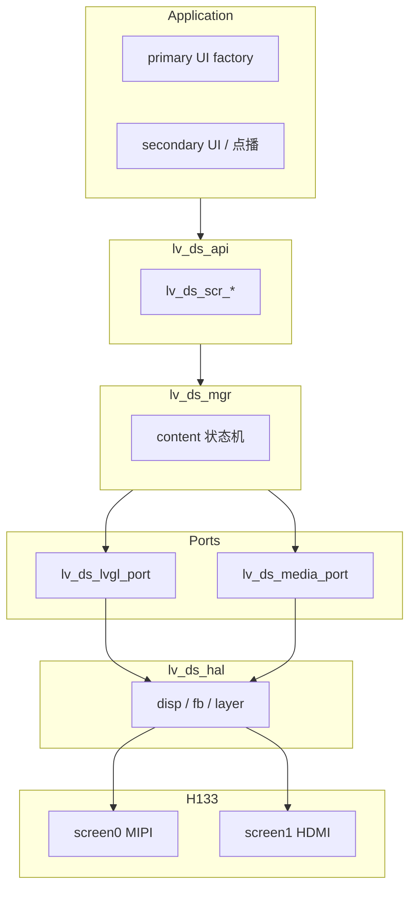

# LV_DS 双屏异显中间件 — 技术架构

本文定义 **H133-02** 及后续产品通用的 **双屏异显 LVGL 中间件**（代号 **`lv_ds`**，Dual-Screen）技术架构。应用以 LVGL 为主开发 UI，通过统一 C API 管理主屏 / 副屏内容，无需直接操作 `/dev/disp`、TPlayer 或 panel 驱动。

**状态**：架构设计稿（待实现）  
**目标平台**：sun8iw20 **H133**，本工程板级 **`p1_nor`**（MIPI + HDMI）

**相关文档**：

- [双屏异显索引](./README.md) — 同显/异显定稿与 TEMP 对照
- [20260806-同异显切换](./20260806-同异显切换/) — WB 常开 + `disp_mode`（当前产品路径）
- skills 侧：`h133-display` 板级档案 / HDMI 原理（按板查阅）

---

## 1. 设计目标

| 目标 | 说明 |
|------|------|
| **异显** | 主屏、副屏内容独立；默认 **不** 将 fb0 镜像到副屏 |
| **LVGL 优先** | 业务 UI 用 LVGL；副屏可为第二套 LVGL，或视频 / 图片 / 纯色 |
| **薄应用** | 应用仅 `#include "lv_ds.h"`，调用 `lv_ds_init()`、`lv_ds_scr_*()` |
| **AI 友好** | 固定目录、统一前缀 `lv_ds_`、板级 JSON、错误码枚举、可编译示例 |
| **可扩展** | 点歌机、广告机、工控 HMI+大屏等共用同一中间件 |

**典型产品场景**：

- **点歌机**：MIPI = 点歌主 UI；HDMI = KTV 视频 MV  
- **双触屏广告机**：两屏各一套 LVGL UI  
- **工控**：MIPI = 操作面板；HDMI = 监控大图 / 视频  

---

## 2. H133 硬件约束（不可违反）

来源：`de_feat.c`、本工程 `board.dts`（详见 [H133-HDMI驱动原理.md](./H133-HDMI驱动原理.md)）。

| 逻辑屏 | 硬件 DISP | 允许输出 | 本工程默认 |
|--------|-----------|----------|------------|
| **screen0** | DISP0 | **仅 LCD**（MIPI/RGB/LVDS） | 10.1" MIPI 800×1280 |
| **screen1** | DISP1 | **HDMI / TV** | HDMI 1080p60 |

- MIPI **不能** 配到 screen1。  
- `chn_cfg_mode = 1`：主显 4 通道 + 副显 2 通道（双显推荐）。  
- `disp_mode = 0`：screen0 为主显并绑定 **fb0**（勿用 `disp_mode=3`，见双显开发记录）。

中间件将 **逻辑屏 ID** 与 **硬件 screen** 的映射写在板级 JSON，应用只使用 `LV_DS_SCR_PRIMARY` / `LV_DS_SCR_SECONDARY`。

---

## 3. 分层架构

```text
┌─────────────────────────────────────────────────────────────┐
│  L5  Application（点歌 / 设置 / 广告 …）                     │
│      只调用 include/lv_ds.h                                 │
└───────────────────────────┬─────────────────────────────────┘
                            │
┌───────────────────────────▼─────────────────────────────────┐
│  L4  lv_ds_api          对外稳定 C API                       │
└───────────────────────────┬─────────────────────────────────┘
                            │
┌───────────────────────────▼─────────────────────────────────┐
│  L3  lv_ds_mgr          屏管理、模式、生命周期、事件、互斥     │
└───────────────┬─────────────────────────┬───────────────────┘
                │                         │
┌───────────────▼──────────┐   ┌──────────▼──────────────────┐
│  L2a lv_ds_lvgl_port     │   │  L2b lv_ds_media_port        │
│  每屏独立 lv_disp_drv   │   │  TPlayer / 静态图 / 纯色       │
└───────────────┬──────────┘   └──────────┬──────────────────┘
                │                         │
┌───────────────▼─────────────────────────▼───────────────────┐
│  L1  lv_ds_hal          /dev/disp、/dev/fb*、layer、HPD       │
└───────────────────────────┬─────────────────────────────────┘
                            │
┌───────────────────────────▼─────────────────────────────────┐
│  L0  lv_ds_board        板级描述（ds_board_*.json）           │
└─────────────────────────────────────────────────────────────┘
```

### 3.1 模块铁律（实现与 Code Review 必查）

1. **应用禁止** 直接 `ioctl(/dev/disp)`、修改 panel 驱动、调用 `CreateVideoOutport` / `TPlayerCreate`（除非在 `lv_ds_media_port` 内部）。  
2. 每个物理输出在逻辑上仅一个 **`lv_ds_scr_id_t`**。  
3. 产品发布构建默认 **关闭** `disp_fb_clone_to_screen`（fb0 不向 HDMI 镜像）。  
4. 两个 LVGL 实例 **禁止** 共用同一块 draw buffer。  
5. `lv_disp_set_default()` 仅在 UI 工厂函数内或 `lv_ds_scr_load_ui()` 包装层切换。

---

## 4. 建议代码目录（待创建）

```text
platform/lv_dual_scr/
├── README.md                    # AI / 新人入口
├── Kconfig / Makefile
├── include/
│   └── lv_ds.h                  # ★ 应用唯一对外头文件
├── config/
│   └── ds_board_p1_nor.json     # ★ 板级真相源
├── src/
│   ├── lv_ds_api.c
│   ├── lv_ds_mgr.c
│   ├── lv_ds_hal_disp.c
│   ├── lv_ds_hal_fb.c
│   ├── lv_ds_lvgl_port.c
│   └── lv_ds_media_port.c
├── port/
│   └── lvgl8/
│       └── lv_ds_lvgl8_glue.c   # 与 sunxifb / disp_layer 对接
├── examples/
│   ├── ex_dual_lvgl.c           # 两屏均为 LVGL
│   └── ex_lvgl_plus_hdmi_video.c
└── docs/
    └── （本文件位于 docs/ 仓库级说明）
```

---

## 5. 核心类型定义

### 5.1 逻辑屏 ID

```c
typedef enum {
    LV_DS_SCR_PRIMARY   = 0,   /* 主屏：主 UI，本工程 = MIPI / screen0 */
    LV_DS_SCR_SECONDARY = 1,   /* 副屏：副 UI 或视频，本工程 = HDMI / screen1 */
    LV_DS_SCR_MAX
} lv_ds_scr_id_t;
```

### 5.2 屏上内容类型

```c
typedef enum {
    LV_DS_CONTENT_NONE   = 0,  /* 关闭 / 黑屏 */
    LV_DS_CONTENT_LVGL   = 1,  /* 该屏独立 LVGL 对象树 */
    LV_DS_CONTENT_VIDEO  = 2,  /* CedarX / TPlayer，占用 disp 视频层 */
    LV_DS_CONTENT_IMAGE  = 3,  /* 静态图一层 */
    LV_DS_CONTENT_COLOR  = 4,  /* 纯色 / 待机画面 */
} lv_ds_content_type_t;
```

同一逻辑屏同一时刻只允许一种 **主内容类型**（由 `lv_ds_mgr` 互斥）；例如副屏在 `VIDEO` 时不得再挂 `LVGL`，除非先 `video_stop` 再切换。

### 5.3 产品运行模式（预设）

```c
typedef enum {
    LV_DS_MODE_DUAL_LVGL,        /* 两屏各一套 LVGL UI */
    LV_DS_MODE_LVGL_PLUS_VIDEO,  /* 主 LVGL + 副视频（点歌机默认） */
    LV_DS_MODE_LVGL_PLUS_IMAGE,  /* 主 LVGL + 副静态图 */
    LV_DS_MODE_PRIMARY_ONLY,     /* 仅主屏，副屏关闭 */
} lv_ds_mode_t;
```

### 5.4 错误码

```c
typedef enum {
    LV_DS_OK = 0,
    LV_DS_ERR_NOT_INIT,
    LV_DS_ERR_SCR_INVALID,
    LV_DS_ERR_SCR_NOT_READY,     /* 如 HDMI 未 HPD */
    LV_DS_ERR_CONTENT_BUSY,
    LV_DS_ERR_LAYER_CONFLICT,
    LV_DS_ERR_MEDIA_FAIL,
    LV_DS_ERR_CONFIG,
} lv_ds_err_t;
```

### 5.5 事件

```c
typedef enum {
    LV_DS_EVT_SECONDARY_CONNECTED,
    LV_DS_EVT_SECONDARY_DISCONNECTED,
    LV_DS_EVT_VIDEO_PREPARED,
    LV_DS_EVT_VIDEO_COMPLETED,
    LV_DS_EVT_VIDEO_ERROR,
} lv_ds_evt_t;

typedef void (*lv_ds_evt_cb_t)(lv_ds_evt_t evt, lv_ds_scr_id_t scr, void *user);
```

---

## 6. 板级配置（`ds_board_p1_nor.json`）

板级参数 **只改 JSON**，避免应用写死分辨率或 screen 号。

```json
{
  "chip": "sun8iw20",
  "board": "p1_nor",
  "screens": [
    {
      "id": "PRIMARY",
      "hw_screen": 0,
      "output": "lcd",
      "width": 800,
      "height": 1280,
      "fb_dev": "/dev/fb0",
      "touch_dev": "/dev/input/event0",
      "lvgl": true,
      "lvgl_backend": "sunxifb"
    },
    {
      "id": "SECONDARY",
      "hw_screen": 1,
      "output": "hdmi",
      "width": 1920,
      "height": 1080,
      "fb_dev": null,
      "lvgl": true,
      "lvgl_backend": "disp_layer",
      "hpd_required": true
    }
  ],
  "disp": {
    "chn_cfg_mode": 1,
    "disp_mode": 0,
    "fb_clone_secondary": false
  },
  "layer_pool": {
    "primary_lvgl":       { "channel": 0, "layer": 0 },
    "secondary_lvgl":     { "channel": 0, "layer": 0 },
    "secondary_video":    { "channel": 1, "layer": 0 }
  }
}
```

说明：

- **PRIMARY**：与当前 `sunxifb` + `/dev/fb0` 一致；UI 可按 800×1280 设计，或与 DTS 一致用 1920×1080 由 DE 缩放（见 §8）。  
- **SECONDARY**：本工程 `fb1_width/height = 0`，副屏 LVGL 走 **`disp_layer`**（参考 `lvgl-9/platform/disp/sunxifb_port_free_rtos_disp2.c` 的 `screen_id` 路径）。  
- **`fb_clone_secondary": false`**：异显核心，对应内核侧关闭或跳过 `disp_fb_clone_to_screen`。

---

## 7. 对外 API 规格（`lv_ds.h`）

### 7.1 生命周期

| API | 说明 |
|-----|------|
| `int lv_ds_init(const char *board_json_path)` | 解析板级配置、打开 disp、注册策略（禁 clone） |
| `void lv_ds_deinit(void)` | 释放资源 |
| `int lv_ds_start(void)` | 按配置 enable 各 output、注册 LVGL display |
| `void lv_ds_stop(void)` | 逆序关闭 |
| `int lv_ds_set_mode(lv_ds_mode_t mode)` | 设置产品模式预设 |

### 7.2 屏信息与就绪

| API | 说明 |
|-----|------|
| `int lv_ds_scr_get_info(lv_ds_scr_id_t scr, lv_ds_scr_info_t *info)` | 宽高、hw_screen、当前 content、是否 connected |
| `bool lv_ds_scr_is_ready(lv_ds_scr_id_t scr)` | 副屏 HDMI 需 HPD 就绪 |

### 7.3 内容与 LVGL

| API | 说明 |
|-----|------|
| `int lv_ds_scr_set_content(lv_ds_scr_id_t scr, lv_ds_content_type_t type)` | 切换内容类型 |
| `lv_disp_t *lv_ds_scr_get_lv_disp(lv_ds_scr_id_t scr)` | 获取该屏 LVGL display（仅 LVGL 内容时有效） |
| `typedef lv_obj_t *(*lv_ds_ui_factory_t)(lv_disp_t *disp)` | UI 工厂：在指定 disp 上建屏 |
| `int lv_ds_scr_load_ui(lv_ds_scr_id_t scr, lv_ds_ui_factory_t factory)` | 加载 / 替换该屏 UI 树 |

### 7.4 视频（副屏典型）

| API | 说明 |
|-----|------|
| `int lv_ds_scr_video_play(lv_ds_scr_id_t scr, const char *url)` | 播放；内部固定 **hw_screen=1** |
| `int lv_ds_scr_video_stop(lv_ds_scr_id_t scr)` | 停止并释放视频层 |
| `int lv_ds_scr_video_set_rect(lv_ds_scr_id_t scr, const lv_ds_rect_t *r)` | `NULL` 表示全屏 |

### 7.5 事件与 tick

| API | 说明 |
|-----|------|
| `void lv_ds_set_event_callback(lv_ds_evt_cb_t cb, void *user)` | HDMI 插拔、播完等 |
| `void lv_ds_tick(uint32_t ms)` | 可选：内部对多个 `lv_disp` 调 `lv_timer_handler` |

---

## 8. LVGL 双屏绑定（LVGL 8）

本工程 GUI 基于 **LVGL 8**（`lv_projector` + `sunxifb`）。

### 8.1 主屏（PRIMARY）

- 路径：`/dev/fb0` → 现有 `sunxifb` flush。  
- 注册一个 `lv_disp_drv_t` + 独立 `lv_disp_draw_buf_t`。  
- 触摸 indev 只挂主屏（或策略路由到主屏）。

### 8.2 副屏（SECONDARY）

| 后端 | 条件 | 实现要点 |
|------|------|----------|
| **sunxifb** | DTS 启用 `fb1` | 第二套 fb 驱动，`FBDEV_PATH=/dev/fb1` |
| **disp_layer**（推荐） | `fb1` 为 0 | ION 缓冲 + `DISP_LAYER_SET_CONFIG`，`ioctlParam[0]=hw_screen`；自定义 `flush_cb` |

参考实现线索：

- `platform/thirdparty/gui/lvgl-9/platform/disp/sunxifb_port_free_rtos_disp2.c`（`screen_id`、`DISP_LAYER_SET_CONFIG`）  
- `platform/allwinner/multimedia/libtmedia/tplayer/awsink/tlayer_ctrl.c`（`CreateVideoOutport(0)` **需改为可配置 screen**）

### 8.3 fb0 分辨率策略

| 策略 | fb0 尺寸 | 优点 | 缺点 |
|------|----------|------|------|
| A | 800×1280 | MIPI 1:1，UI 清晰 | 与当前 DTS 1920×1080 不一致时需改 DTS |
| B | 1920×1080 | 与现网 BSP 一致 | MIPI 竖屏由 DE 缩放，UI 需适配 |

中间件在 `lv_ds_scr_get_info()` 返回 **实际 drawable 尺寸**，应用按返回值布局。

---

## 9. 数据流与异显示意

### 9.1 点歌机模式（`LV_DS_MODE_LVGL_PLUS_VIDEO`）

```text
  Application
       │
       ├─ lv_ds_scr_load_ui(PRIMARY, ui_home_factory)
       │       └─► lv_disp_primary ──► fb0 ──► DE screen0 ──► MIPI 800×1280
       │
       └─ lv_ds_scr_video_play(SECONDARY, url)
               └─► TPlayer / disp layer ──► DE screen1 ──► HDMI 1080p

  （无 fb0 clone 到 HDMI）
```

### 9.2 双 LVGL 模式（`LV_DS_MODE_DUAL_LVGL`）

```text
  lv_disp_primary    ──► MIPI
  lv_disp_secondary  ──► HDMI（disp_layer 或 fb1）
```

### 9.3 Mermaid 总览



---

## 10. 与现有 BSP 的对接项

实现中间件时须处理（详见 [H133-MIPI-HDMI双显开发记录.md](./H133-MIPI-HDMI双显开发记录.md)）：

| 项 | 现状 | 中间件要求 |
|----|------|------------|
| `disp_fb_clone_to_screen` | HDMI HPD 后会 clone fb0 | **产品态关闭**（Kconfig 或 `lv_ds_init` 策略） |
| TPlayer 默认 screen | `CreateVideoOutport(0)` | `lv_ds_media_port` 使用 **hw_screen=1** |
| `default_lcd` / DCS 表 | 已恢复 | 不纳入 lv_ds，保持 BSP |
| MIPI `boot_info.sync` | 与备份一致 | 不强制 reopen LCD |
| 编译 | 改内核需 `build.sh kernel` + 整包烧录 | 文档化，不写在应用里 |

---

## 11. 应用开发模板

```c
#include "lv_ds.h"

static lv_obj_t *ui_home_create(lv_disp_t *disp)
{
    lv_disp_set_default(disp);
    lv_obj_t *scr = lv_obj_create(NULL);
    /* 点歌主界面 */
    lv_scr_load(scr);
    return scr;
}

static void on_ds_event(lv_ds_evt_t evt, lv_ds_scr_id_t scr, void *user)
{
    (void)user;
    if (evt == LV_DS_EVT_SECONDARY_CONNECTED && scr == LV_DS_SCR_SECONDARY) {
        /* 可选：副屏待机 UI 或黑屏 */
    }
}

void app_main(void)
{
    lv_ds_init("ds_board_p1_nor.json");
    lv_ds_set_mode(LV_DS_MODE_LVGL_PLUS_VIDEO);
    lv_ds_set_event_callback(on_ds_event, NULL);
    lv_ds_start();

    lv_ds_scr_load_ui(LV_DS_SCR_PRIMARY, ui_home_create);

    for (;;) {
        lv_ds_tick(5);
        usleep(5000);
    }
}

void app_play_mv(const char *path)
{
    lv_ds_scr_set_content(LV_DS_SCR_SECONDARY, LV_DS_CONTENT_VIDEO);
    lv_ds_scr_video_play(LV_DS_SCR_SECONDARY, path);
}
```

**约定**：

- 业务 **不** 在播片时把 `lv_disp_set_default` 切到副屏，主屏 UI 线程始终面向 PRIMARY。  
- 切歌：`video_stop` → 再 `video_play`，不重启 `lv_ds_init`。

---

## 12. 模块职责表

| 模块 | 负责 | 不负责 |
|------|------|--------|
| `lv_ds_hal_disp` | screen enable、layer 分配、HPD、禁止 fb clone | LVGL 控件 |
| `lv_ds_hal_fb` | fb open/mmap、分辨率查询 | 页面逻辑 |
| `lv_ds_lvgl_port` | 每屏 disp_drv、flush、draw_buf | 点播业务 |
| `lv_ds_media_port` | TPlayer 封装、screen_id、zorder | UI 布局 |
| `lv_ds_mgr` | content 互斥、模式、事件分发 | 硬件寄存器 |
| `lv_ds_api` | 参数校验、错误码 | 直接画屏 |

---

## 13. AI / 协作开发约定

1. **单头文件**：应用只 `#include "lv_ds.h"`。  
2. **板级只改 JSON**：新板复制 `ds_board_xxx.json`，不改 API 签名。  
3. **文件头注释模板**：

```c
/**
 * @module lv_ds_api
 * @layer   L4
 * @calls   lv_ds_mgr
 * @used_by application
 */
```

4. **示例即规范**：`examples/ex_*.c` 为 AI 生成业务代码的 golden reference。  
5. **禁止在应用中出现**：`CreateVideoOutport`、`disp_fb_clone`、`DISP_LAYER_SET_CONFIG`（除非在 `lv_ds_hal` 内）。

---

## 14. 实施路线图（建议）

| 阶段 | 内容 | 验收 |
|------|------|------|
| **P0** | `lv_ds_hal` + 板级 JSON + 禁 fb clone | HDMI 不显示 fb0 镜像 |
| **P1** | PRIMARY `sunxifb` + `lv_ds_scr_load_ui` | MIPI 点歌 UI 正常 |
| **P2** | SECONDARY `disp_layer` + 副屏 LVGL | HDMI 显示独立 LVGL 页 |
| **P3** | `lv_ds_media_port` screen1 视频 | MIPI UI + HDMI 全屏 MV 异显 |
| **P4** | 事件 HPD、错误恢复、示例 `ex_lvgl_plus_hdmi_video` | 热插拔、切歌稳定 |

---

## 15. 二期扩展（可选）

- `lv_ds_scr_screenshot()` — 调试  
- `lv_ds_scr_set_rotation()` — MIPI 竖屏旋转  
- LVGL 9 移植：`port/lvgl9/`，API 不变  
- 统一 `lv_ds_tick` 内多 display 刷新，避免应用漏调  

---

## 16. 修订记录

| 日期 | 版本 | 说明 |
|------|------|------|
| 2026-05-21 | 0.1 | 初稿：LV_DS 双屏异显中间件架构，供后续 `platform/lv_dual_scr` 实现 |

---

*实现代码目标路径：`platform/lv_dual_scr/`。BSP 变更仍遵循 [工程编译方式.txt](./工程编译方式.txt) 与 [H133-MIPI-HDMI双显开发记录.md](./H133-MIPI-HDMI双显开发记录.md)。*
